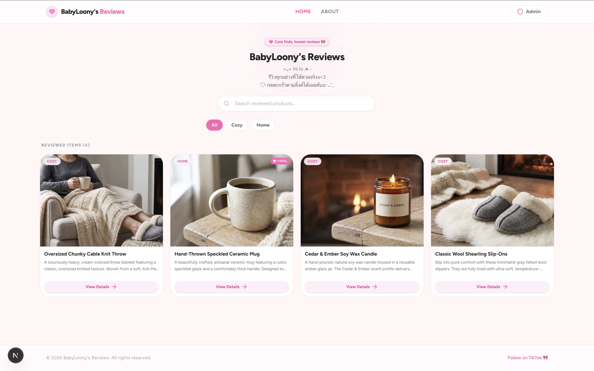
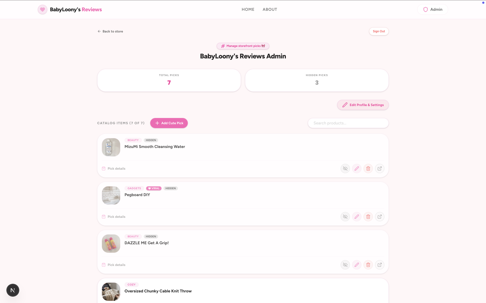
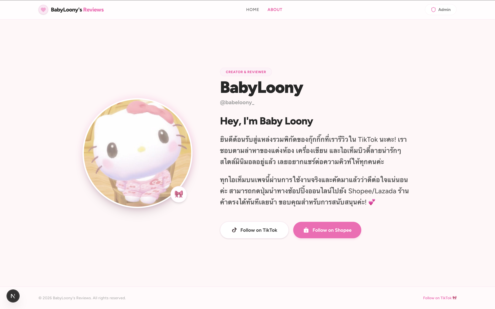

# Loony Reviews Storefront

A mobile-first product reviews storefront built with Next.js (App Router), Tailwind CSS, and Firebase Firestore. 

### 🇹🇭 Tailored for Social Reviewers in Thailand
This application is designed specifically for content creators and influencers in Thailand who review aesthetic products on social media platforms (such as TikTok) and share affiliate shop links (such as **Shopee Thailand** or **Lazada Thailand**). It provides followers with a clean, centralized, girly-themed storefront to easily browse reviews and access direct shopping links in one sweet place.

---

## Screenshots Reference

> [!NOTE]
> Create the folder `public/screenshots/` and save your screenshots there to display them:
> - **Homepage Storefront:** 
> - **Admin Dashboard:** 
> - **About Page:** 

---

## Detailed Feature Architecture

### 1. Storefront Catalog & Product Views
* **Dynamic Product Grid**: Renders products stored in Firestore. Features responsive, mobile-first cards showing key details (name, rating, price, and category) with direct navigation.
* **Affiliate Link Redirection**: Direct affiliate shopping links integrated via dedicated action buttons (Shopee, Lazada, TikTok Shop).
* **Category Filtering**: Automatically aggregates distinct categories from the product list and provides active filter chips to easily narrow down the catalog.
* **Catalog Search**: Real-time client-side search filtering that updates the product grid as the user types, matching against product names and descriptions.
* **Dynamic Details Pages**: Slug-based routing (`/products/[slug]`) displaying the product's full information, rating, price, affiliate purchase links, and external video review links inside a clean card frame.

### 2. Dynamic & Customizable About Page (`/about`)
* **Dynamic Typography & Biography**: Renders title heading and biography paragraphs dynamically loaded from Firestore. If fields are cleared by the administrator, they render conditionally to keep the layout clean.
* **Dynamic Avatar Upload**: Allows custom profile avatar image rendering, loaded dynamically from settings.
* **Thai E-commerce & Social Links**: Features brand-compliant follow buttons for **TikTok Thailand** (`/tiktok.svg`) and **Shopee Thailand** (`/shopee.svg`).
* **Cardless Split Layout**: Responsive desktop design rendering profile avatar on the left and biographic info on the right, stacking vertically on mobile.

### 3. Secured Administration Portal (`/admin`)
* **Secure Login**: Protected portal utilizing Firebase Authentication (Email & Password provider).
* **Access Control Guard**: Enforces authorization by verifying the logged-in user's email against the `NEXT_PUBLIC_ADMIN_EMAIL` environment variable. Unmatched accounts are signed out automatically.
* **Product Catalog CRUD**: Administrators can add new products, update product attributes, toggle product visibility (hide/show), and delete items.
* **Dynamic Catalog Search**: Real-time search box allowing administrators to filter product lists by title, description, or category instantly.
* **Toggleable Storefront Settings**: A dedicated, collapsible settings card (hidden by default under "Edit Profile & Settings") to configure homepage description, About title, biography paragraphs, and upload a custom profile picture.

### 4. Data Storage & Image Handling
* **Base64 Image Pipeline**: Image files uploaded through the admin console are converted to Base64 data strings in the browser using `FileReader.readAsDataURL()`. The resulting string is saved directly within the Firestore product document, bypassing the need for Firebase Storage configuration.
* **Defensive Image Verification**: Front-end components parse the image attribute using check utilities (`startsWith("data:image/")`). If the data URL is malformed, missing, or truncated, the app automatically falls back to an inline SVG placeholder, preventing broken images and `net::ERR_INVALID_URL` errors.
* **Single-Collection Settings Storage**: Storefront configurations (such as the hero description text) are saved inside the `/products` collection under a dedicated document ID `_settings`. The data fetching functions (`fetchProducts` and `fetchProductBySlug`) explicitly ignore document IDs starting with `_` to prevent administrative configurations from appearing in the shoppable catalog.

---

## Technology Stack

* **Framework**: Next.js 16 (App Router, TypeScript)
* **Styling**: Tailwind CSS 4
* **Database & Auth**: Firebase Firestore & Firebase Authentication
* **Icons**: Hugeicons React & Lucide React

---

## Project Structure

```
├── src/
│   ├── app/                    # Next.js App Router pages
│   │   ├── about/              # About page (Biography card)
│   │   ├── admin/              # Secured Admin login and console dashboard
│   │   ├── categories/         # Category listing views
│   │   ├── products/           # Dynamic product details view
│   │   └── page.tsx            # Main storefront homepage
│   ├── components/
│   │   ├── layout/             # Shared Navbar and Footer elements
│   │   ├── products/           # Product cards, grids, and buy buttons
│   │   └── ui/                 # Reusable buttons, forms, and alerts
│   ├── data/
│   │   └── sample-products.ts  # Static fallback mock data
│   ├── lib/
│   │   ├── firebase.ts         # Firebase SDK configuration & initialization
│   │   └── products-service.ts # Firestore query & command services
│   └── types/
│       └── product.ts          # TypeScript interfaces
```

---

## Installation & Configuration

### 1. Installation

Clone the repository and install the dependencies:
```bash
npm install
```

### 2. Environment Variables

Create a `.env.local` file in the root of the project:
```env
NEXT_PUBLIC_ADMIN_EMAIL=your-admin-email@domain.com
NEXT_PUBLIC_FIREBASE_API_KEY=your_firebase_api_key
NEXT_PUBLIC_FIREBASE_AUTH_DOMAIN=your_project_id.firebaseapp.com
NEXT_PUBLIC_FIREBASE_PROJECT_ID=your_project_id
NEXT_PUBLIC_FIREBASE_STORAGE_BUCKET=your_project_id.firebasestorage.app
NEXT_PUBLIC_FIREBASE_MESSAGING_SENDER_ID=your_messaging_sender_id
NEXT_PUBLIC_FIREBASE_APP_ID=your_app_id
```

### 3. Firebase Console Configuration
1. Enable **Cloud Firestore** and **Authentication** in your Firebase console.
2. In the Authentication tab, enable the **Email/Password** sign-in method.
3. Create your admin user account (ensure the email matches the `NEXT_PUBLIC_ADMIN_EMAIL` environment variable).

### 4. Firestore Security Rules
Go to **Firestore Database > Rules** in the Firebase Console and deploy the following:
```javascript
rules_version = '2';
service cloud.firestore {
  match /databases/{database}/documents {
    match /products/{document} {
      // Anyone can read products (public storefront)
      allow read: if true;
      // Only the authenticated admin email can modify catalog items and settings
      allow write: if request.auth != null && 
                     request.auth.token.email == 'your-admin-email@domain.com';
    }
  }
}
```
> [!IMPORTANT]
> Replace `'your-admin-email@domain.com'` with your actual admin email configured in your environment.

### 5. Seed Mock Products (Optional)
To seed the Firestore database with sample products:
```bash
npm run db:seed
```

### 6. Start the Development Server
```bash
npm run dev
```
Open [http://localhost:3000](http://localhost:3000) to view the storefront locally.

---

## Production Deployment

### Vercel Deployment
1. Link your Git repository in the **Vercel** dashboard.
2. Add the environment variables configured in your `.env.local` file to the Vercel project settings.
3. Deploy. Vercel automatically detects Next.js configurations and builds the production bundle.
